[](http://makeapullrequest.com)  

# DIAYN-PyTorch

While intelligent  creatures can explore their environments and learn useful skills without supervision, many RL algorithms are heavily on the basis that acquiring skills is only achieved via defining them as explicit reward functions to learn.
    
Thus, in order to translate the natural behavior of creatures in learning **diverse** skills to a suitable mathematical formulation, DIAYN (Diversity is All You Need) was proposed for learning useful skills **without any domain-specific reward function**.
    
Instead of the real reward of the environment, DIAYN optimizes the following objective:

<p align="center">
  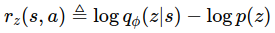
</p>

that _`z`_ is the skill that the agent is learning and, since we desire learned skills to be **as diverse as possible**, _`z`_ is modeled by a Uniform random variable that has the highest standard variation.
    
The above equation simply implies that the reward of any diverse task is equal to measuring how hard recognizing the skill _`z`_ is, given the state _`s`_ that the agent has visited compared to the real distribution over _`z`_ (which is Uniform distribution in DIAYN paper.)   
The bigger r<sub>z</sub>(s, a) is, the more ambiguous skill _`z`_ is thus, the state _`s`_ should be visited more for task _`z`_ so, the agent finally acquires this skill.

Concurrently to learn r<sub>z</sub>(s, a), any conventional RL method can be utilized to learn a policy and DIAYN uses SAC.

**This repository is a PyTorch implementation of Diversity is All You Need and the SAC part of the code is based on [this repo](https://github.com/alirezakazemipour/SAC).**

## Results
> x-axis in all of the corresponding plots in this section are counted by number episode.

### Hopper
>number of skills = 20

<p align="center">
  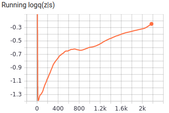
</p>

similar to the environment's goal| Emergent behavior| Emergent behavior
:-----------------------:|:-----------------------:|:-----------------------:
| | 
Reward distribution|Reward distribution|Reward distribution
| 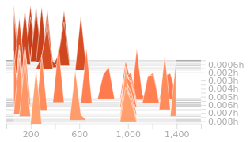| 

### BipedalWalker
>number of skills = 50

<p align="center">
  
</p>

similar to the environment's goal| Emergent behavior| Emergent behavior
:-----------------------:|:-----------------------:|:-----------------------:
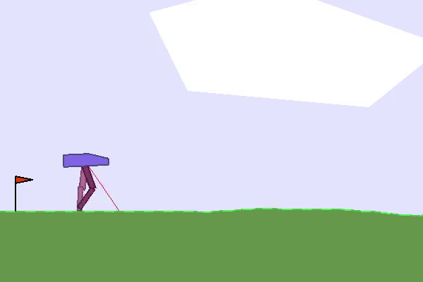| 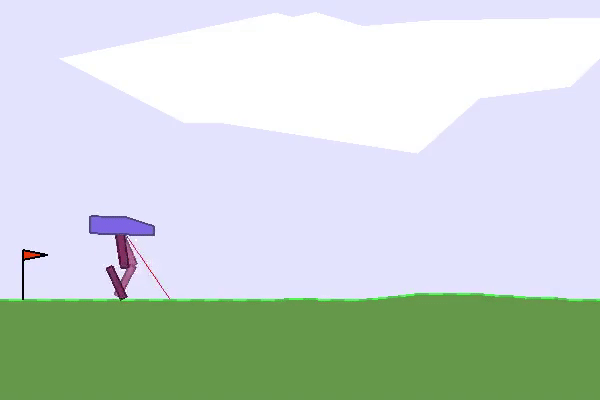| 
Reward distribution|Reward distribution|Reward distribution
| | 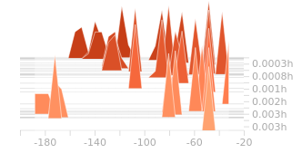

### MountainCarContinuous
>number of skills = 20

<p align="center">
  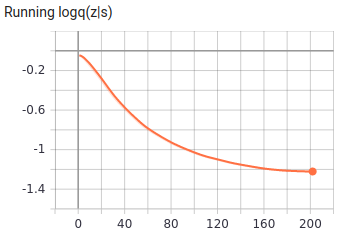
</p>

similar to the environment's goal| Emergent behavior| Emergent behavior
:-----------------------:|:-----------------------:|:-----------------------:
| | 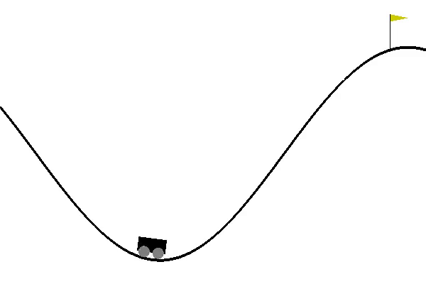
Reward distribution|Reward distribution|Reward distribution
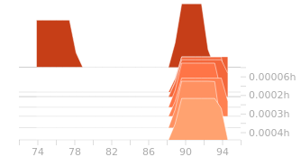| | 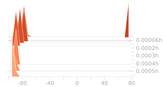

## Dependencies
- gym == 0.17.3
- mujoco-py == 2.0.2.13
- numpy == 1.19.2
- opencv_contrib_python == 4.4.0.44
- psutil == 5.5.1
- torch == 1.6.0
- tqdm == 4.50.0

## Installation
```bash
pip3 install -r requirements.txt
```
* Note, this way maybe not work. On my server, I use:
    1. download the mujoco210, unzip the file, and write down the PATH in the .bashrc
    2. git down the mujoco-py source code, and `python setup.py install`
    3. `pip install gym==0.17.3`
    4. (maybe useful) `pip install opencv-python==4.3.0.38`, `pip install box2d box2d-kengz`
    5. the other packages are not difficult to install, don't care about the edition

## Usage
### How to run
```bash
usage: main.py [-h] [--env_name ENV_NAME] [--interval INTERVAL] [--do_train]
               [--train_from_scratch] [--mem_size MEM_SIZE]
               [--n_skills N_SKILLS] [--reward_scale REWARD_SCALE]
               [--seed SEED]

Variable parameters based on the configuration of the machine or user's choice

optional arguments:
  -h, --help            show this help message and exit
  --env_name ENV_NAME   Name of the environment.
  --interval INTERVAL   The interval specifies how often different parameters
                        should be saved and printed, counted by episodes.
  --do_train            The flag determines whether to train the agent or play
                        with it.
  --train_from_scratch  The flag determines whether to train from scratch or
                        continue previous tries.
  --mem_size MEM_SIZE   The memory size.
  --n_skills N_SKILLS   The number of skills to learn.
  --reward_scale REWARD_SCALE   The reward scaling factor introduced in SAC.
  --seed SEED           The randomness' seed for torch, numpy, random & gym[env].
```
- **In order to train the agent with default arguments , execute the following command and use `--do_train` flag, otherwise the agent would be tested** (You may change the memory capacity, the environment and number of skills to learn based on your desire.):
```shell
python3 main.py --mem_size=1000000 --env_name="Hopper-v3" --interval=100 --do_train --n_skills=20
```
- **If you want to keep training your previous run, execute the followoing:**
```shell
python3 main.py --mem_size=1000000 --env_name="Hopper-v3" --interval=100 --do_train --n_skills=20 --train_from_scratch
```
### An important Note!!!
- **When I tried to keep training from checkpoints to continue my previous run, I observed some undesirable behavior from the discriminator that its loss rapidly converged towards 0 however, after some epochs it again returned to its correct previous training phase. I suspect since at the beginning of training from checkpoints the replay memory is empty and familiar experiences (according to the policy) gradually get added to it, the trained discriminator from the previous run can easily recognize their true skills until the replay memory gets populated big enough and contains newer and more novel transitions. Thus, I recommend running your whole training monotonically and avoid using checkpoints and successive pausing though, it is been provided.**

## Environments tested
- [x] Hopper-v3
- [x] bipedalWalker-v3
- [x] MountainCarContinuous-v0
- [ ] HalfCheetah-v3 

## Structure
```bash
├── Brain
│   ├── agent.py
│   ├── __init__.py
│   ├── model.py
│   └── replay_memory.py
├── Checkpoints
│   ├── BipedalWalker
│   │   └── params.pth
│   ├── Hopper
│   │   └── params.pth
│   └── MountainCar
│       └── params.pth
├── Common
│   ├── config.py
│   ├── __init__.py
│   ├── logger.py
│   └── play.py
├── Gifs
│   ├── BipedalWalker
│   │   ├── skill11.gif
│   │   ├── skill40.gif
│   │   └── skill7.gif
│   ├── Hopper
│   │   ├── skill2.gif
│   │   ├── skill8.gif
│   │   └── skill9.gif
│   └── MountainCar
│       ├── skill3.gif
│       ├── skill7.gif
│       └── skill8.gif
├── LICENSE
├── main.py
├── README.md
├── requirements.txt
└── Results
    ├── BipedalWalker
    │   ├── running_logq.png
    │   ├── skill11.png
    │   ├── skill40.png
    │   └── skill7.png
    ├── equation.png
    ├── Hopper
    │   ├── running_logq.png
    │   ├── skill2.png
    │   ├── skill8.png
    │   └── skill9.png
    ├── MountainCar
    │   ├── running_logq.png
    │   ├── skill3.png
    │   ├── skill7.png
    │   └── skill8.png
    └── r_z.png
```
1. _Brain_ dir consists of the neural network structure and the agent decision-making core.
2. _Common_ consists of minor codes that are common for most RL codes and do auxiliary tasks like logging and... .
3. _main.py_ is the core module of the code that manages all other parts and makes the agent interact with the environment.

## Reference

1. [_Diversity is All You Need: Learning Skills without a Reward Function_, Eysenbach, 2018](https://arxiv.org/abs/1802.06070)

## Acknowledgment
**Big thanks to:**

1. [@ben-eysenbach ](https://github.com/ben-eysenbach) for [sac](https://github.com/ben-eysenbach/sac).
2. [@p-christ](https://github.com/p-christ) for [DIAYN.py](https://github.com/p-christ/Deep-Reinforcement-Learning-Algorithms-with-PyTorch/blob/master/agents/hierarchical_agents/DIAYN.py).
3. [@johnlime](https://github.com/johnlime) for [RlkitExtension](https://github.com/johnlime/RlkitExtension).
4. [@Dolokhow](https://github.com/Dolokhow) for [rl-algos-tf2 ](https://github.com/Dolokhow/rl-algos-tf2).


## 本地训练试验（09.13）

这个库完成还算可以，目前还没有与论文仔细比对，单从运行情况，是可以训练以及评估模型，并且可视化生成视频也没有问题。

* 因为服务器没有外接显示器，所以需要虚拟运行（评估时），我们通过`xvfb`虚拟出一个图形界面，如果没有这个库，可以通过`apt-get install xvfb`安装

`xvfb-run -s "-screen 0 1400x900x24" python3 main.py --mem_size=1000000 --env_name="MountainCarContinuous-v0" --interval=100 --n_skills=20`

* 在评估时，由于`env.render(mode='rgb_array')`带有参数，目的是拿到图片，所以要注释掉 `libGLEW.so` , 而训练时`state = env.reset()`直接获取的状态空间向量，并不是图像像素。这个时候可以加上`libGLEW.so`。但目前还没有尝试过以图像作为输入的算法，设置细节可能还会有变化。

在Hopper-v3环境上使用内置参数，完整训练耗时15个半小时，以下是对比原始模型权重的评估结果

* **train**

<p align="center">
  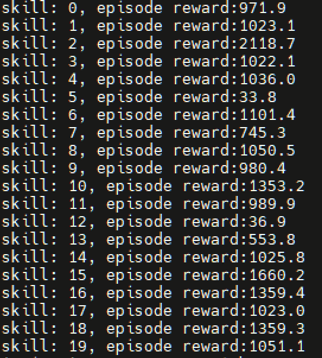
</p>

* **origin**
<p align="center">
  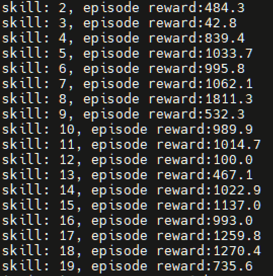
</p>

